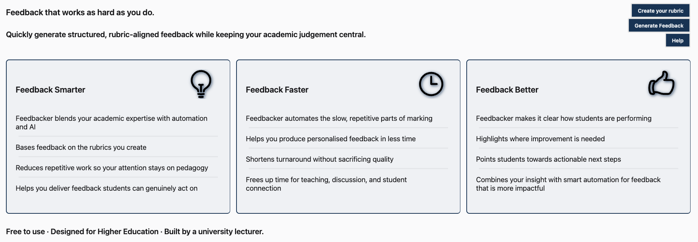

# Feedbacker

AI-assisted feedback that enables educators to feedback smarter, faster, better.

## Live Deployment

Try Feedbacker here: https://feedbacker.education/

## Table of Contents

- [Feedbacker](#feedbacker)
  - [Overview](#overview)
  - [Why Feedbacker Exists](#why-feedbacker-exists)
  - [Responsible Use of AI](#responsible-use-of-ai)
  - [Limitations](#limitations)
  - [Intended Audience](#intended-audience)
  - [Use in Teaching Contexts](#use-in-teaching-contexts)
  - [Institutional Deployment](#institutional-deployment)
  - [Design Principles](#design-principles)
  - [Technology Stack](#technology-stack)
  - [Install](#install)
  - [Local Development](#local-development)
  - [Project Status](#project-status)
  - [Maintainer](#maintainer)
  - [Contributing](#contributing)
  - [Citation](#citation)
  - [License](#license)

## Overview

Feedbacker is designed for responsible AI-assisted feedback in higher education.

## Why Feedbacker Exists

Providing high-quality feedback is one of the most valuable — and time-intensive — parts of teaching. Increasing student numbers and administrative pressures often reduce the time educators can spend crafting meaningful responses.

Feedbacker was created to support educators by automating repetitive aspects of feedback while preserving academic judgement and pedagogical intent. The goal is not to replace educators, but to help them scale thoughtful, actionable feedback in a sustainable way.

## Responsible Use of AI

Feedbacker is designed to support — not replace — academic judgement.

- AI generates draft feedback only.
- Educators remain responsible for reviewing, editing, and approving all outputs.
- The system does not automate grading decisions.
- Feedback remains transparent and attributable to the educator.

Feedbacker aligns with emerging UK higher-education guidance encouraging AI as an assistive tool rather than an autonomous assessor.

## Limitations

Feedbacker assists feedback writing but does not:

- replace academic judgement
- verify factual correctness of feedback
- assess academic misconduct
- assign final grades automatically

Educators should always review outputs before sharing with students.

## Intended Audience

Feedbacker is designed primarily for:

- Higher education lecturers and tutors
- Foundation and undergraduate teaching
- Educators using rubric-based assessment
- Institutions exploring responsible AI-assisted marking workflows

## Use in Teaching Contexts

Feedbacker has been developed alongside real teaching practice and is intended to support:

- formative feedback workflows
- rubric-based assessment
- draft feedback generation
- feedback consistency across cohorts

It is particularly suited to large-cohort modules where maintaining feedback quality and turnaround time is challenging.

## Institutional Deployment

Feedbacker can be:

- used via the public deployment
- self-hosted by institutions
- configured with institution-approved AI providers
- adapted to local assessment policies

The application is intentionally lightweight to enable experimentation and pilot adoption.

## Design Principles

Feedbacker is guided by the following principles:

- **Human-led feedback** — AI assists, educators decide
- **Transparency** — outputs remain editable and reviewable
- **Pedagogy first** — educational value takes priority over automation
- **Efficiency without dehumanisation** — save time without losing voice
- **Institutional compatibility** — works alongside existing assessment practices

## Quick Start

1. Visit the live deployment: https://feedbacker.education/
2. Enter assessment criteria or rubric information
3. Provide student work or summary notes
4. Generate draft feedback and refine as needed

## Feedback Smarter

- Blends academic expertise with automation and AI
- Keeps feedback human-focused, not machine-generated
- Reduces repetitive work so the educators attention stays on pedagogy
- Helps deliver feedback students can genuinely act on

## Feedback Faster

- Automates the slow, repetitive parts of marking
- Helps produce personalised feedback in less time
- Shortens turnaround without sacrificing quality
- Frees up time for teaching, discussion, and student connection

## Feedback Better

- Makes it clear how students are performing
- Highlights where improvement is needed
- Points students towards actionable next steps
- Combines insight with smart automation for feedback that is more impactful

## Technology Stack

- [node](https://nodejs.org/en/)
- [Next.js](https://nextjs.org/)
- [OpenRouter](https://openrouter.ai/)

## Install

This project uses [node](http://nodejs.org/) and [pnpm](https://pnpm.io). If you've not done so, please install those first. Then clone this repository, switch to its root directory, and type `pnpm install`.

## Local Development

You will need to create a `.env` file in the root directory, with the following four variables:

1. NEXT_PUBLIC_OPENROUTER_URL
2. NEXT_PUBLIC_OPENROUTER_KEY
3. NEXT_PUBLIC_OPENROUTER_MODEL
4. NEXT_PUBLIC_TITLE
5. NEXT_PUBLIC_HOMEPAGE

Where NEXT_PUBLIC_OPENROUTER_URL is the URL of the [OpenRouter](https://openrouter.ai/) completions API, NEXT_PUBLIC_OPENROUTER_KEY is the API key and NEXT_PUBLIC_OPENROUTER_MODEL is the AI model to use. NEXT_PUBLIC_TITLE and NEXT_PUBLIC_HOMEPAGE are not so important - they help define the app's title and public URL.

Once you've defined those variables, you can run a local development server via `pnpm dev`.

## Project Status

Active development.

Feedbacker is currently used in real teaching contexts and continues to evolve based on educator feedback.

## Maintainer

[Steve Huckle](https://huckle.studio/).

## Contributing

Contributions welcome - please email the maintainer.

## Citation

If you use Feedbacker in research or teaching practice, please cite:

Huckle, S. (2025). *Feedbacker: AI-assisted feedback for higher education*. https://feedbacker.education/

## License

Creative Commons [Attribution 4.0 International Deed (CC BY 4.0)](https://creativecommons.org/licenses/by/4.0/)

